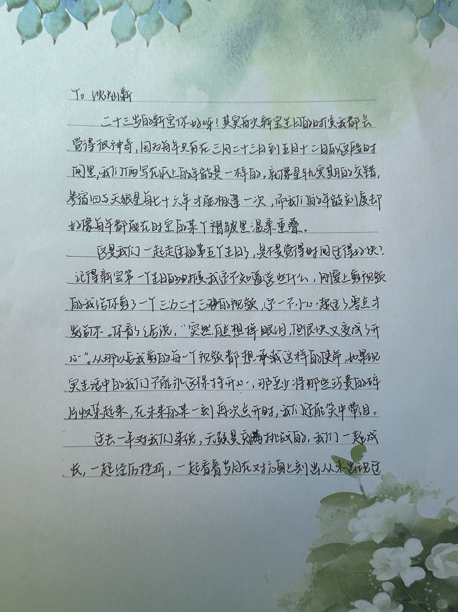
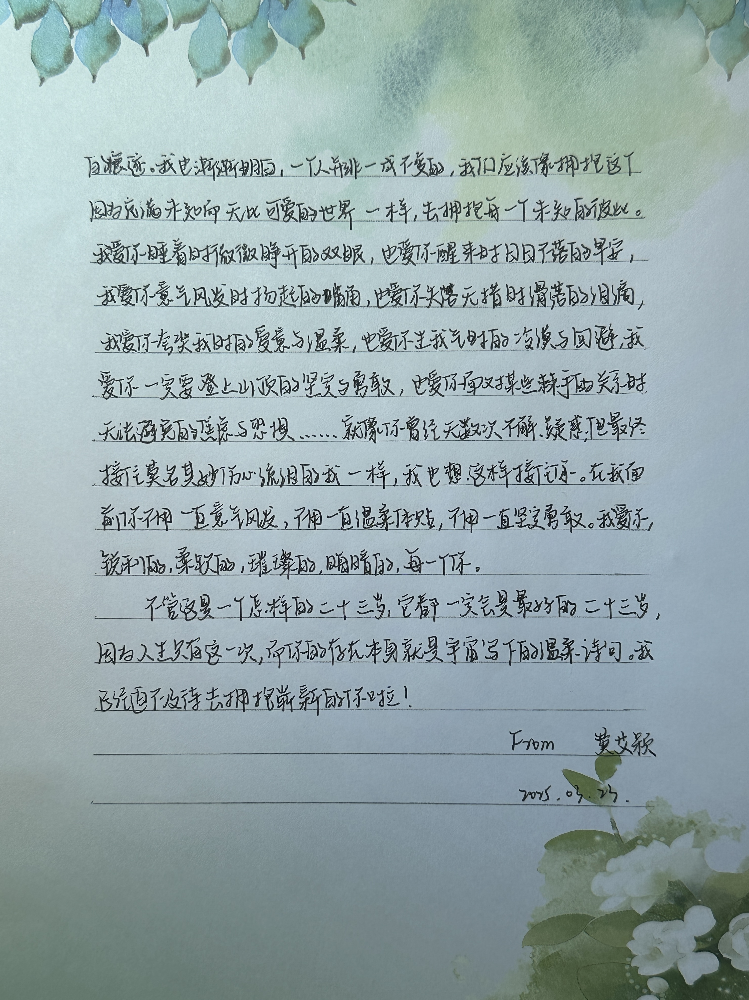

--- 
title: "A Letter for You" 
output: 
   html_document:
     toc: false
     toc_float: false 
---

# 🎂 Happy Birthday! 🎉💖

<!-- 生日信展开按钮 -->

<button class="custom-button" onclick="revealLetter()">💌 点击展开生日信</button>

<!-- 生日信内容（默认隐藏） -->

    

<!-- 播放音乐按钮 -->

    <button class="music-button" onclick="playMusic()">🎶 播放音乐</button>

<!-- 🎶 音频播放器（默认隐藏） -->
<audio id="bgMusic" loop>
    <source src="audio/your-music-file.ogg" type="audio/ogg">
    <source src="audio/your-music-file.mp3" type="audio/mpeg">
    你的浏览器不支持播放音乐。
</audio>

<!-- JavaScript 代码 -->

