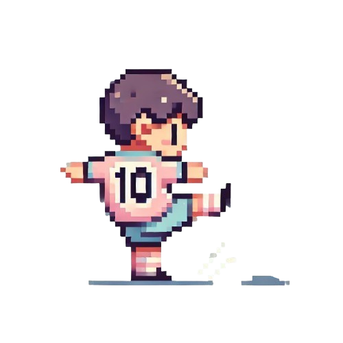

```{r, echo=FALSE, results='asis'}
cat('<link rel="stylesheet" href="style.css">')
```


<!-- **游戏容器** -->
<div id="gameContainer">



<p id="gameMessage">🏆 试着射门吧！</p>
</div>

<!-- 🎵 播放音乐按钮 -->
<button id="music-button" class="music-button">🎶 播放音乐</button>

<!-- 🎶 音频播放器（默认隐藏） -->
<audio id="bgMusic" loop>
    <source src="audio/黄霄雲-玫瑰星云.ogg" type="audio/ogg">
    <source src="audio/黄霄雲-玫瑰星云.mp3" type="audio/mpeg">
    你的浏览器不支持播放音乐。
</audio>

<script>
document.addEventListener("DOMContentLoaded", function() {
    const gameContainer = document.getElementById("gameContainer");
    const player = document.getElementById("player");
    const ball = document.getElementById("ball");
    const goal = document.getElementById("goal");
    const gameMessage = document.getElementById("gameMessage");
    const music = document.getElementById("bgMusic");
    const musicButton = document.getElementById("music-button");

  let playerX, playerY, ballX, ballY;
  let ballMoving = false;
  let ballStopping = false;
  let reachedGoalHeight = false;
  let ballInterval = null;

  function updateSizes() {
        const containerWidth = gameContainer.offsetWidth;
        const containerHeight = gameContainer.offsetHeight;
      player.style.width = `${containerWidth * 0.12}px`;
      ball.style.width = `${containerWidth * 0.05}px`;
     goal.style.width = `${containerWidth * 0.35}px`;
     resetPositions(containerWidth, containerHeight);
    }
    function resetPositions(containerWidth, containerHeight) {
        playerX = containerWidth * 0.4;
        playerY = containerHeight * 0.8;
        ballX = playerX + 0.2 * playerX;
        ballY = playerY + 0.1 * playerY;
        ballMoving = false;
        ballStopping = false;
        reachedGoalHeight = false;
        goal.style.left = "50%";
        goal.style.top = "10%";
        goal.style.transform = "translateX(-50%)";
        player.style.left = `${playerX}px`;
        player.style.top = `${playerY}px`;
        ball.style.left = `${ballX}px`;
        ball.style.top = `${ballY}px`;
        gameMessage.innerText = "🏆 试着射门吧！";
    }
    updateSizes();
    document.addEventListener("keydown", function(event) {
        const containerWidth = gameContainer.offsetWidth;
        const containerHeight = gameContainer.offsetHeight;
        if (event.key === "ArrowLeft" && playerX > 0) {
            playerX -= containerWidth * 0.03;
            if (!ballMoving) ballX -= containerWidth * 0.03;
        }
        if (event.key === "ArrowRight" && playerX < containerWidth - player.offsetWidth) {
            playerX += containerWidth * 0.03;
            if (!ballMoving) ballX += containerWidth * 0.03;
        }
        // **按空格键射门**
        if (event.key === " " && !ballMoving) {
            ballMoving = true;
            ballStopping = false; 
            ballInterval = setInterval(() => {                 
            if (!ballStopping) {                     
            ballY -= 30; // 控制球的上升速度                     
            ball.style.top = `${ballY}px`;                     
            // 获取球门边界
            const goalRect = goal.getBoundingClientRect();   
            const goalMinHeight = goalRect.top + ballRect.height + goalRect.height * 0.4;
             const goalMaxHeight = goalRect.bottom -  goalRect.height*0.02;
            // 只有当球在合理高度范围内，才设置 reachedGoalHeight
            if (ball.getBoundingClientRect().top >= goalMinHeight && 
                ball.getBoundingClientRect().top <= goalMaxHeight) {                         
                reachedGoalHeight = true;                     
            }                 
        }             
    }, 50);   
            // **第二次按空格键停止球**
            document.addEventListener("keydown", function stopBall(event) {
                if (event.key === " " && ballMoving && !ballStopping) {
                    ballStopping = true;
                    clearInterval(ballInterval); // 停止球的上升
                    checkGoal(); // 计算是否进球
                    document.removeEventListener("keydown", stopBall);
                }
            });
        }
        player.style.left = `${playerX}px`;
        player.style.top = `${playerY}px`;
        ball.style.left = `${ballX}px`;
        ball.style.top = `${ballY}px`;
    });
    // **进球判定**
  function checkGoal() {
    const goalRect = goal.getBoundingClientRect();
    const ballRect = ball.getBoundingClientRect();
    const ballCenterX = ballRect.left + ballRect.width / 2;
    const ballCenterY = ballRect.top + ballRect.height / 2;
    const goalLeft = goalRect.left;
    const goalRight = goalRect.right;
    const goalTop = goalRect.top;
    const goalBottom = goalRect.top + goalRect.height;
    // 设置合理的进球高度范围（调整参数以优化进球判定）
      const goalMinHeight = goalRect.top + ballRect.height + goalRect.height * 0.4;
      const goalMaxHeight = goalRect.bottom -  goalRect.height*0.02;
    if (ballCenterY < goalMinHeight) {
        gameMessage.innerText = "❌ 太高了，飞出去了！";
    } else if (ballCenterY > goalMaxHeight) {
        gameMessage.innerText = "❌ 太低了，没进球！";
    } else if (ballCenterX >= goalLeft && ballCenterX <= goalRight) {
        gameMessage.innerText = "🥳 进球啦！";
    } else {
        gameMessage.innerText = "❌ 射偏了！";
    }
    setTimeout(() => {
        updateSizes();
    }, 1000);
}
    window.addEventListener("resize", updateSizes);
    // 🎵 **音乐控制逻辑**
    function playMusic() {
        if (music.paused) {
            music.play();
        } else {
            music.pause();
        }
    }
    // 只允许鼠标点击播放/暂停音乐，避免空格键影响
    musicButton.addEventListener("click", function(event) {
        event.stopPropagation();
        playMusic();
    });
    // **阻止空格键影响音乐**
    document.addEventListener("keydown", function(event) {
        if (event.key === " " || event.keyCode === 32) {
            event.preventDefault();
        }
    });
});
</script>

<style>
/* 让整个网页作为游戏背景 */
body {
    background: linear-gradient(to right, #ff9a9e, #fad0c4);
    text-align: center;
    font-family: "Poppins", sans-serif;
    color: #4A4A4A;
}

/* 游戏容器 */
#gameContainer {
    position: relative;
    width: 60vw;
    height: 80vh;
    margin: 0 auto;
    overflow: hidden;
    border: 2px solid rgba(255, 255, 255, 0.3);
}

/* 球门 */
#goal {
    position: absolute;
    width: 30%;
    left: 50%;
    top: 10%;
    transform: translateX(-50%);
}

/* 让球员和球可以移动 */
#player, #ball {
    position: absolute;
    transition: left 0.1s ease-in-out, top 0.1s ease-in-out;
}

/* 提示信息 */
#gameMessage {
    font-size: 2vw;
    font-weight: bold;
    color: #ff4757;
    margin-top: 10px;
}

/* 音乐按钮 */
.music-button {
    font-size: 16px;
    padding: 10px;
    border-radius: 5px;
    background: #ff4757;
    color: white;
    cursor: pointer;
}
</style>
