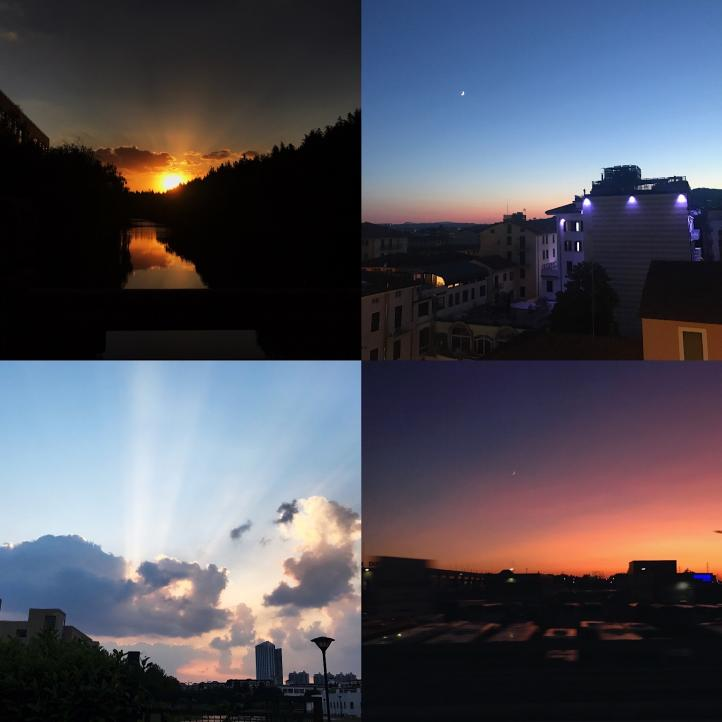

# This is Jeff's awesome website

Here's a gif of eimo


You can add text

* and lists
* with extra bullets

You can *FORMAT* and **bold?**

This is a [link](https://www.google.com/) to a good data science tool

Here is a link to [P105](https://p8105.com). Here's a link to the [about](about.html) page

You can also still use R!


```{r}
library(tidyverse)
plot_df=
  tibble(
    x=runif(100),
    y=1+2*x+rnorm(100)
  )
plot_df|>
  ggplot(aes(x=x,y=y))+
  geom_point()
```


# Here's a new section

My favorate city is Shanghai. This is a set of pictures I took there:



Also here's a set of pictures I took in another beautiful city, Venice:


