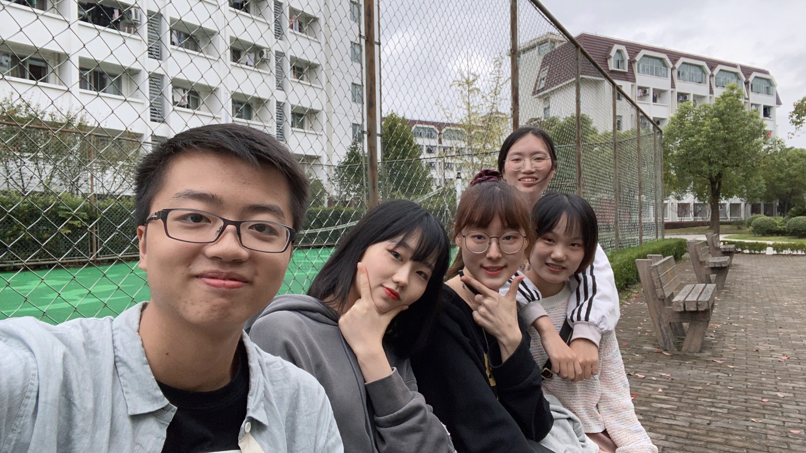
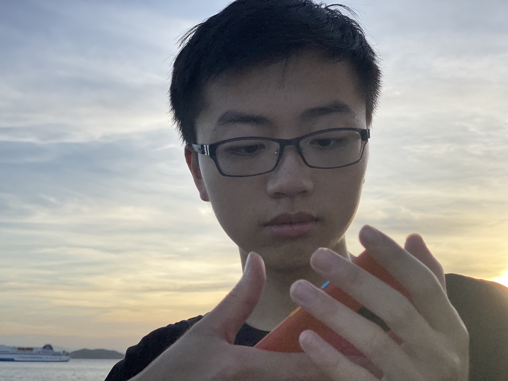

# When you were a little boy

# The first time we took pictures together

# The first Christmas since we were together

# The first birthday for you since we were together

# Hangzhou

# Xiamen

# Covid-19 Quarantine

# Long-hair

# 2022-2023 

# The actual second birthday we celebrated together

# Trip to Changshu

# Graduation!

# Chuanxi

# First CP photo shoot

# Chongqing

# 2023-2024

# Chongming

# The first time shooting the Milky Way

# Hiking

# To be continued...

<button class="music-button" onclick="playMusic()">🎶 播放音乐</button>

<!-- 🶠音频播放器（默认éšè—） --> <audio id="bgMusic" loop> <source src="audio/your-music-file.ogg" type="audio/ogg"> <source src="audio/your-music-file.mp3" type="audio/mpeg"> ä½ çš„æµè§ˆå™¨ä¸æ”¯æŒæ’­æ”¾éŸ³ä¹ã€‚ </audio> 
 